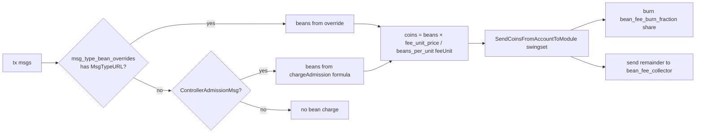

# Beans v2 as a governance-tunable deflationary mechanism

| | |
| --- | --- |
| Status | draft |
| Date | 2026-07-07 |
| Origin | community thread "Using Agoric beans v2 as a deflationary mechanism" (Michael_FIG), community.agoric.com/t/using-agoric-beans-v2-as-a-deflationary-mechanism/954 |
| Scope | `golang/cosmos/x/swingset`, `golang/cosmos/ante`, `packages/cosmic-swingset` |

## Problem

SwingSet already bills asynchronous JS work in *beans*, a unit distinct from
Cosmos gas. The cosmos-side fee path exists today but has three properties the
community proposal wants changed:

1. **Latent, invisible deduction.** `Keeper.ChargeBeans`
   (`golang/cosmos/x/swingset/keeper/keeper.go`) accrues a per-address
   `beansOwing` balance in vstorage and only debits coins when the balance
   crosses an integer multiple of `beans_per_unit["minFeeDebit"]`
   (default 2e11 beans, roughly $0.20). The debit is a bank send from the
   signer to the `vbank/reserve` module account
   (`vbanktypes.ReservePoolName`, wired as the SwingSet keeper's
   `feeCollectorName` in `golang/cosmos/app/app.go`). The client signs a tx
   whose `fee` field says nothing about this; some later transaction
   crosses the threshold and pays for its predecessors. The thread calls
   this "spooky action at a distance".
2. **Charge shape is code, not parameters.** The bean *prices* are already
   governance parameters (`Params.BeansPerUnit`, `Params.FeeUnitPrice` in
   `golang/cosmos/proto/agoric/swingset/swingset.proto`, mutable via a
   param-change proposal with no software upgrade), but the *formula* and
   the set of message types it covers are hardcoded: `chargeAdmission`
   (`golang/cosmos/x/swingset/types/msgs.go`) charges
   `inboundTx + message×count + messageByte×bytes + storageByte×storage`,
   and only for messages implementing `vm.ControllerAdmissionMsg`
   (`MsgDeliverInbound`, `MsgWalletAction`, `MsgWalletSpendAction`,
   `MsgInstallBundle`, chunk messages). Charging a non-SwingSet message
   type, or re-weighting one message type, requires an upgrade.
3. **No burn.** Proceeds always land in `vbank/reserve`. There is no
   governance-selectable disposition, so the mechanism cannot be made
   deflationary without an upgrade.

## Requirements (from the community thread)

1. All deflation-related parameters tunable by staker governance, no
   software upgrade required.
2. Per-message-type overrides, a parameter such as `msgTypeBeanOverrides`
   letting different message types carry different bean charges.
3. Bean fees folded into simulation and gas estimation so clients see the
   combined cost before signing.
4. Deduction happens before standard Cosmos processing, with proceeds
   burned or redirected per a governance parameter.

## Design

### New `x/swingset` parameters

Extend `Params` in `swingset.proto` (all reachable through the existing
legacy `x/params` subspace, `ParamKeyTable` in
`golang/cosmos/x/swingset/types/params.go`, so requirement 1 is satisfied
by the same param-change proposal path that already governs
`beans_per_unit`):

```protobuf
// Per-message-type bean charges, keyed by proto type URL.
// A matching entry REPLACES the default admission formula for that type;
// its beans list reuses the beans_per_unit unit vocabulary plus a flat
// "perMessage" key. An entry may name a type with no default charge
// (for example "/cosmos.distribution.v1beta1.MsgWithdrawDelegatorReward").
repeated MsgTypeBeans msg_type_bean_overrides = 11;

// Disposition of collected bean fees: the fraction burned, with the
// remainder sent to fee_remainder_collector.
string bean_fee_burn_fraction = 12;   // LegacyDec in [0,1], default "0"

// Module account receiving the unburned remainder.
// Default "vbank/reserve" preserves current behavior.
string bean_fee_collector = 13;

// Price used to translate bean fees into gas during simulation, so the
// client's (gas × gas-price) estimate covers the bean deduction.
repeated cosmos.base.v1beta1.DecCoin bean_gas_price = 14;
```

`MsgTypeBeans` is `{ string msg_type_url; repeated StringBeans beans; }`,
reusing the existing `StringBeans` shape so JS mirrors
(`packages/cosmic-swingset/src/sim-params.js`, which today mirrors
`default-params.go`) extend naturally.

### Charge path: one ante decorator, immediate deduction

Today the charge rides `AdmissionDecorator` → `CheckAdmissibility` →
`chargeAdmission` → `ChargeBeans` (the decorator already sits after
`ante.NewDeductFeeDecoratorWithName` and signature verification in
`golang/cosmos/ante/ante.go`, so bean deduction is already pre-execution;
what is missing is immediacy, coverage, and disposition).

Replace the charging half of that path with a new `BeanFeeDecorator` in
`golang/cosmos/ante` placed adjacent to `AdmissionDecorator`:



- **Coverage (requirement 2):** the decorator iterates `tx.GetMsgs()` and
  keys `sdk.MsgTypeURL(msg)` into `msg_type_bean_overrides`, so any Cosmos
  message type can carry a charge, not only `vm.ControllerAdmissionMsg`
  implementers.
- **Immediacy (requirement 4):** the computed fee is converted to coins at
  once (same arithmetic as `ChargeBeans`:
  `beans × fee_unit_price / beans_per_unit["feeUnit"]`) and moved
  `SendCoinsFromAccountToModule` into the `x/swingset` module account
  during the ante phase, before any message executes. Insufficient funds
  reject the tx up front instead of mid-execution. The `beansOwing` /
  `minFeeDebit` batching is retained only for charges that are genuinely
  asynchronous (see Open questions).
- **Disposition (requirement 4):** from the module account,
  `bean_fee_burn_fraction` of the coins is destroyed with
  `BankKeeper.BurnCoins` (the deflationary arm) and the remainder is
  forwarded `SendCoinsFromModuleToModule` to `bean_fee_collector`
  (default `vbank/reserve`, other useful values: `authtypes.FeeCollectorName`
  so vbank's reward smoothing pays validators, or `vbank/giveaway`).
- **Transparency events:** the decorator emits a typed event per charge
  (msg type URL, beans, coins, disposition split) so explorers and wallets
  can display what was deducted and why.

### Simulation and gas estimates (requirement 3)

`AdmissionDecorator.AnteHandle` already special-cases `simulate` (it
swallows admission errors "otherwise our gas estimation will be too low").
`BeanFeeDecorator` goes further: under `simulate` it skips the bank
movements and instead consumes synthetic gas,
`gas += coins / bean_gas_price`, so the standard Cosmos simulate RPC
returns a `gas_used` that, multiplied by the client's gas price, covers
the bean fee. Clients need no new API; existing wallets see the combined
fee up front. The simulate response's message logs additionally carry the
typed charge event for clients that want to itemize.

### Migration

- Genesis/upgrade default: `msg_type_bean_overrides = []`,
  `bean_fee_burn_fraction = "0"`, `bean_fee_collector = "vbank/reserve"`,
  `bean_gas_price` unset (simulation folding off). With those defaults the
  chain behaves exactly as today; every deviation is a later governance
  act, which is the thread's "general rails, not a one-off" ask.
- `UpdateParams` in `golang/cosmos/x/swingset/types/params.go` already
  appends missing entries with defaults; the new fields follow the same
  pattern, so the upgrade handler needs no bespoke state migration.
- JS mirror: extend `sim-params.js` and the `ParamsSDKType` usage in
  `packages/cosmic-swingset` so simulated chains exercise the same shape.

## Out of scope

- Computron accounting (`xsnapComputron`, `blockComputeLimit`,
  `vatCreation` beans consumed by `computronCounter` in
  `packages/cosmic-swingset/src/launch-chain.js`): that is a block run
  policy, not a per-account fee, and is untouched here.
- `PowerFlagFees` provisioning fees (`ChargeForProvisioning`,
  `calculateFees`): already coin-denominated parameters; unchanged.
- Contract-level (Zoe/IST) fee policy: this design is chain-layer only.

## Open questions

- Should `beansOwing` / `minFeeDebit` batching be retired entirely once
  ante-time deduction lands, or kept for asynchronous charges such as
  `ChargeForSmartWallet` (auto-provision during wallet-action admission)?
  Retiring it simplifies the model but changes the cost profile of many
  small messages (each pays exactly, instead of every fifth-or-so tx
  paying a lump).
- Does the burn apply per-denom? `fee_unit_price` is `Coins`; burning
  `ubld` is deflationary for BLD, burning IST has different monetary
  semantics (IST supply is managed by Inter Protocol). Should
  `bean_fee_burn_fraction` be per-denom, or should validation constrain
  `fee_unit_price` to a single denom when the burn fraction is nonzero?
- Simulation double-counting: during simulate, `CheckAdmissibility` today
  still runs `chargeAdmission` against simulate state. If the new
  decorator adds synthetic gas while the old path also attempts the coin
  movement, estimates could double. Proposed resolution is to make
  `BeanFeeDecorator` the only charging site and reduce
  `CheckAdmissibility` to pure admission (queue and size checks), but
  that touches every `vm.ControllerAdmissionMsg` implementation; confirm
  no other caller relies on `CheckAdmissibility` charging.
- Do override charges bypass exemptions that exist today, such as
  privileged provisioning via the `provisionpass` balance
  (`privilegedProvisioningCoins` in
  `golang/cosmos/x/swingset/keeper/keeper.go`) and high-priority-queue
  senders? A governance-set charge on, say,
  `MsgWithdrawDelegatorReward` presumably should not be waivable, but
  SwingSet message charges may want to keep the existing carve-outs.
- Fee-payer identity: `chargeAdmission` charges the message's
  submitter/owner field, while Cosmos gas is paid by the tx fee payer
  (possibly a feegrant). Should the new decorator charge the fee payer
  (aligning with gas, enabling feegrants for bean fees) or preserve
  per-message submitter billing?
- Parameter plumbing: `x/swingset` still uses the legacy `x/params`
  subspace on cosmos-sdk v0.53.4. Add the new fields to the same subspace
  (cheapest, consistent), or take this as the moment to migrate the
  module to self-owned params with `MsgUpdateParams` gated on the
  governance authority address (the keeper already receives
  `authtypes.NewModuleAddress(govtypes.ModuleName)` in `app.go`)?
- `bean_gas_price` semantics: is a distinct param right, or should the
  translation reuse the node-local minimum gas price / a consensus
  min-gas-price so the fold-in cannot drift from what validators charge
  for gas? A consensus-level param avoids per-node divergence in
  simulation results.
