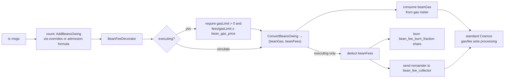

# Beans v2 as a governance-tunable deflationary mechanism

| | |
| --- | --- |
| Status | draft |
| Date | 2026-07-07 |
| Revised | 2026-07-07 — folded in the implementation spec at hackmd.io/@michaelfig/B1kUP-XMGg (the `AddBeansOwing`/`ConvertBeansOwing` split, ante-time enforcement, min-gas-price simulation folding, Go-formula-to-params migration) |
| Origin | community thread "Using Agoric beans v2 as a deflationary mechanism" (Michael_FIG), community.agoric.com/t/using-agoric-beans-v2-as-a-deflationary-mechanism/954; implementation spec hackmd.io/@michaelfig/B1kUP-XMGg |
| Scope | `golang/cosmos/x/swingset`, `golang/cosmos/ante`, `packages/cosmic-swingset` |

## Problem

SwingSet already bills asynchronous JS work in *beans*, a unit distinct from
Cosmos gas. The cosmos-side fee path exists today but has three properties the
community proposal wants changed:

1. **Latent, invisible deduction.** `Keeper.ChargeBeans`
   (`golang/cosmos/x/swingset/keeper/keeper.go`) accrues a per-address
   `beansOwing` balance in vstorage and only debits coins when the balance
   crosses an integer multiple of `beans_per_unit["minFeeDebit"]`
   (default 2e11 beans, roughly $0.20). The debit is a bank send from the
   signer to the `vbank/reserve` module account
   (`vbanktypes.ReservePoolName`, wired as the SwingSet keeper's
   `feeCollectorName` in `golang/cosmos/app/app.go`). The client signs a tx
   whose `fee` field says nothing about this; some later transaction
   crosses the threshold and pays for its predecessors. The thread calls
   this "spooky action at a distance".
2. **Charge shape is code, not parameters.** The bean *prices* are already
   governance parameters (`Params.BeansPerUnit`, `Params.FeeUnitPrice` in
   `golang/cosmos/proto/agoric/swingset/swingset.proto`, mutable via a
   param-change proposal with no software upgrade), but the *formula* and
   the set of message types it covers are hardcoded: `chargeAdmission`
   (`golang/cosmos/x/swingset/types/msgs.go`) charges
   `inboundTx + message×count + messageByte×bytes + storageByte×storage`,
   and only for messages implementing `vm.ControllerAdmissionMsg`
   (`MsgDeliverInbound`, `MsgWalletAction`, `MsgWalletSpendAction`,
   `MsgInstallBundle`, chunk messages). Charging a non-SwingSet message
   type, or re-weighting one message type, requires an upgrade.
3. **No burn.** Proceeds always land in `vbank/reserve`. There is no
   governance-selectable disposition, so the mechanism cannot be made
   deflationary without an upgrade.

## Requirements (from the community thread and the HackMD spec)

1. All deflation-related parameters tunable by staker governance, no
   software upgrade required.
2. Per-message-type overrides, a parameter such as `msg_type_bean_overrides`
   letting different message types carry different bean charges.
3. Bean fees folded into simulation and gas estimation so clients see the
   combined cost before signing.
4. Deduction happens before standard Cosmos processing, with proceeds
   burned or redirected per a governance parameter.

## Design

The HackMD spec fixes the implementation shape: **counting stays an
accounting-only act against the existing `beansOwing` balance, and the
deduction moves into the ante handler, expressed in gas-meter terms.**
`ChargeBeans` splits into `AddBeansOwing` (track debt, never touch the
bank) and `ConvertBeansOwing` (drain the debt into a gas amount and a fee
amount at ante time). A minimum-gas-price parameter ties the two worlds
together: during simulation it translates bean fees into extra `gas_used`
so the client's estimate covers them; during execution it is an enforced
floor on the tx's effective gas price, so the extra gas consumed
corresponds to real fee value. Finally, the bean calculations currently
hardcoded in Go migrate into `msg_type_bean_overrides` entries, so the
formula itself — not just its prices — becomes a governance parameter.

### New `x/swingset` parameters

Extend `Params` in `swingset.proto` (all reachable through the existing
legacy `x/params` subspace, `ParamKeyTable` in
`golang/cosmos/x/swingset/types/params.go`, so requirement 1 is satisfied
by the same param-change proposal path that already governs
`beans_per_unit`):

```protobuf
// Per-message-type bean charges, keyed by proto type URL.
// A matching entry REPLACES the default admission formula for that type;
// each beans entry pairs a beans_per_unit-style unit key with the bean
// price this message type pays per occurrence of that unit. An entry may
// name a type with no default charge (for example
// "/cosmos.distribution.v1beta1.MsgWithdrawDelegatorReward").
repeated MsgTypeBeans msg_type_bean_overrides = 11;

// Disposition of collected bean fees: the fraction burned, with the
// remainder sent to bean_fee_collector.
string bean_fee_burn_fraction = 12;   // LegacyDec in [0,1], default "0"

// Module account receiving the unburned remainder.
// Default "vbank/reserve" preserves current behavior.
string bean_fee_collector = 13;

// Minimum gas price. Dual role: during simulation it translates bean
// fees into extra gas (gas += bean fee ÷ bean_gas_price) so the client's
// (gas × gas-price) estimate covers the bean deduction; during execution
// it is an enforced floor on supplied_fees / supplied_gas_limit, so the
// bean gas counted against the meter corresponds to at least the bean
// fee in real coins.
repeated cosmos.base.v1beta1.DecCoin bean_gas_price = 14;
```

`MsgTypeBeans` is `{ string msg_type_url; repeated StringBeans beans; }`,
reusing the existing `StringBeans` shape so JS mirrors
(`packages/cosmic-swingset/src/sim-params.js`, which today mirrors
`default-params.go`) extend naturally.

Naming reconciliation with the HackMD spec:

- `msg_type_bean_overrides` here **is** the HackMD's
  `msgTypeBeanOverrides: Array<[MsgType, Array<[Unit, UIntString]>]>` —
  the same parameter, spelled proto-side. The HackMD chooses arrays of
  entries over maps "for deterministic ordering"; `repeated MsgTypeBeans`
  gives the same determinism.
- `bean_gas_price` here **is** the HackMD's "new minimum gas price
  parameter". The first draft of this design used it only as a
  simulation-time translation price; the HackMD widens it into an
  execution-time floor as well, and this design follows. The HackMD's
  implementation notes say the minimum is "encoded in `beansPerUnit`
  parameter values", i.e. carried as entries in the existing
  `beans_per_unit` menu rather than a new proto field; whether it lives
  there or as the dedicated field above is an encoding choice, surfaced
  in Open questions.
- The HackMD's `AnteHandlerDecorator` changes and this design's
  `BeanFeeDecorator` are **the same thing**: one updated/added decorator
  in `golang/cosmos/ante` that enforces the floor, converts the owed
  beans, and disposes of the fee. This design keeps the concrete name
  `BeanFeeDecorator` for the new code.

### Splitting `ChargeBeans`: counting is accounting, conversion is ante

Today the charge rides `AdmissionDecorator` → `CheckAdmissibility` →
`chargeAdmission` → `ChargeBeans`, which both tracks the debt and (past
the `minFeeDebit` threshold) moves coins. Per the HackMD, split
`Keeper.ChargeBeans` (`golang/cosmos/x/swingset/keeper/keeper.go`) in two:

- **`AddBeansOwing(ctx, addr, msgType, unit, amount)`** — accounting
  only: record bean debt in the `x/swingset` KVStore (`beansOwing`),
  never touch a bank account. The `msgType`/`unit` arguments let the
  keeper consult `msg_type_bean_overrides` (an override entry replaces
  the default per-unit price for that message type) and emit a typed
  provenance event per charge.
- **`ConvertBeansOwing(ctx, beansPerUnit, addr, suppliedGasLimit,
  suppliedFees) (beanGas, beanFees)`** — drain the address's
  `beansOwing` balance, leaving only dust or nothing; convert the owed
  beans into coins by the existing arithmetic
  (`beans × fee_unit_price / beans_per_unit["feeUnit"]`) and, via the
  minimum gas price, into a gas amount. Returns the gas due to beans and
  the fee due to beans for the caller to dispose of; the keeper itself
  moves no coins here either.

All `vm.ControllerAdmissionMsg` implementations switch from `ChargeBeans`
to `AddBeansOwing` — admission keeps *counting* exactly where it counts
today (so per-message data like byte and storage sizes are in hand), but
no longer charges. Message types with an `msg_type_bean_overrides` entry
but no admission path (arbitrary Cosmos messages such as
`MsgWithdrawDelegatorReward`) are counted by the ante decorator itself,
which iterates `tx.GetMsgs()` and keys `sdk.MsgTypeURL(msg)` into the
overrides (requirement 2: any message type can carry a charge).

Because `ConvertBeansOwing` drains the *whole* balance, it also sweeps
debt accrued under the old batching model by earlier transactions — the
`minFeeDebit` threshold stops governing tx-submitter charges the moment
this lands, with no state migration.

### `BeanFeeDecorator`: enforcement and disposition (requirement 4)

The new/updated decorator in `golang/cosmos/ante` (the HackMD's
"AnteHandlerDecorator changes") runs **before the builtin Cosmos SDK
gas/fee ante processing** (`ante.NewDeductFeeDecoratorWithName`), so the
bean skim happens ahead of conventional execution:



- **Floor check (executing only):** require `suppliedGasLimit > 0` and
  effective gas price `suppliedFees / suppliedGasLimit ≥ bean_gas_price`.
  This is what makes the gas-meter expression of bean fees sound: gas
  consumed at a floored price is worth at least the corresponding coins.
- **Convert:** call `swingsetKeeper.ConvertBeansOwing(...)`, then count
  `beanGas` against the context's gas meter — the bean charge occupies
  part of the supplied gas limit, exactly as the HackMD's "deduct the
  extra portion of the gas limit".
- **Dispose (executing only):** deduct `beanFees` from the payer and
  split it per params — `bean_fee_burn_fraction` of the coins destroyed
  with `BankKeeper.BurnCoins` via the `x/swingset` module account (the
  deflationary arm), the remainder forwarded
  `SendCoinsFromModuleToModule` to `bean_fee_collector` (default
  `vbank/reserve`; other useful values: `authtypes.FeeCollectorName` so
  vbank's reward smoothing pays validators, or `vbank/giveaway`).
  Insufficient funds reject the tx up front instead of mid-execution.
  How the builtin `DeductFeeDecorator` then sees the remaining fee
  (deduct `suppliedFees − beanFees`, or an equivalent carve-out) is an
  implementation point flagged in Open questions.
- **Transparency events:** the decorator emits a typed event per charge
  (msg type URL, beans, coins, disposition split) so explorers and
  wallets can display what was deducted and why.

### Simulation and gas estimates (requirement 3)

`AdmissionDecorator.AnteHandle` already special-cases `simulate` (it
swallows admission errors "otherwise our gas estimation will be too
low"). Under `simulate`, `BeanFeeDecorator` skips the floor check and all
bank movements but still calls `ConvertBeansOwing` and consumes `beanGas`
(`beanGas = bean fee coins ÷ bean_gas_price`) — so the standard Cosmos
simulate RPC returns a `gas_used` that already includes the bean charge.
A client that multiplies that estimate by its own gas price (which the
execution-time floor forces to be at least `bean_gas_price`) covers the
bean fee with no new API; existing wallets see the combined fee up
front. The simulate response's message logs additionally carry the typed
charge event for clients that want to itemize.

### Migration

- Genesis/upgrade default: `msg_type_bean_overrides = []`,
  `bean_fee_burn_fraction = "0"`, `bean_fee_collector = "vbank/reserve"`,
  `bean_gas_price` unset (simulation folding and floor off). With those
  defaults the chain behaves exactly as today; every deviation is a later
  governance act, which is the thread's "general rails, not a one-off"
  ask.
- **Go formula → params (HackMD plan step 4):** migrate the bean
  calculations currently hardcoded in `x/swingset` Go into equivalent
  `msg_type_bean_overrides` entries — the upgrade handler (or genesis for
  new chains) seeds one entry per `vm.ControllerAdmissionMsg` type,
  pairing the units `chargeAdmission` charges today (`inboundTx`,
  `message`, `messageByte`, `storageByte`) with their current
  `beans_per_unit` prices. From then on re-weighting or dropping a
  message type's charge is a param change, no software upgrade
  (requirement 1 applied to the formula, not just the prices). The
  hardcoded formula remains only as the fallback for types with no
  override entry — or is deleted once the seeding is trusted; see Open
  questions.
- `UpdateParams` in `golang/cosmos/x/swingset/types/params.go` already
  appends missing entries with defaults; the new fields follow the same
  pattern, so the upgrade handler needs no bespoke state migration beyond
  the seeding above.
- JS mirror: extend `sim-params.js` and the `ParamsSDKType` usage in
  `packages/cosmic-swingset` so simulated chains exercise the same shape.

## Out of scope

- Computron accounting (`xsnapComputron`, `blockComputeLimit`,
  `vatCreation` beans consumed by `computronCounter` in
  `packages/cosmic-swingset/src/launch-chain.js`): that is a block run
  policy, not a per-account fee, and is untouched here.
- `PowerFlagFees` provisioning fees (`ChargeForProvisioning`,
  `calculateFees`): already coin-denominated parameters; unchanged.
- Contract-level (Zoe/IST) fee policy: this design is chain-layer only.

## Open questions

- **Override entry semantics.** The HackMD's example entry
  `['/cosmos.distribution.v1beta1.MsgWithdrawDelegatorReward', [['message', '1000000000']]]`
  is captioned "charge an arbitrary number of beans per withdraw reward
  message". This design reads each `[unit, value]` pair as a per-message-
  type *price menu* — `value` beans per occurrence of `unit` (1 for
  `message`, the byte count for `messageByte`, …) — because that reading
  lets the seeded entries express today's size-dependent admission
  formula. The alternative reading (`value` = a count of `unit`s priced
  at the global `beans_per_unit` rate) cannot express per-byte terms
  statically. Confirm the intended semantics.
- **Interplay with the builtin `DeductFeeDecorator`.** After
  `BeanFeeDecorator` deducts and disposes of `beanFees`, does the builtin
  fee deduction operate on `suppliedFees − beanFees` (requires adjusting
  the fee the decorator chain sees) or on the full fee with the bean
  portion carved out of the fee collector afterwards? The HackMD says
  only "before continuing with the standard Cosmos gas/fee ante handler
  processing"; the net-of-beans reading avoids double-charging and is
  assumed here.
- **Decorator ordering.** Today `AdmissionDecorator` (where counting
  happens) sits *after* `ante.NewDeductFeeDecoratorWithName`; the bean
  conversion must run after counting but before the builtin fee
  deduction. Does the admission/counting stage move earlier wholesale,
  or does `BeanFeeDecorator` take over counting for the current tx? The
  ante chain in `golang/cosmos/ante/ante.go` needs an explicit new order.
- **Where does the minimum gas price live?** This design gives it a
  dedicated `bean_gas_price` DecCoin param; the HackMD encodes it "in
  `beansPerUnit` parameter values" (entries in the existing menu, which
  are unit-keyed `sdk.Uint`s and would need a denom convention). A
  dedicated field is more legible; the menu encoding avoids a proto
  change. Related: should it instead reuse a consensus-level min-gas-price
  so the fold-in cannot drift from what validators charge for gas?
- **Residual `beansOwing` uses.** `ConvertBeansOwing` supersedes the
  `minFeeDebit` threshold for tx-submitter charges, but charges with no
  enclosing tx to drain them — for example `ChargeForSmartWallet`
  (auto-provision during wallet-action admission) or future contract-side
  billing — still accrue. Do those keep the old threshold-debit path, or
  wait for the address's next signed tx to sweep them?
- **Does the burn apply per-denom?** `fee_unit_price` is `Coins`; burning
  `ubld` is deflationary for BLD, burning IST has different monetary
  semantics (IST supply is managed by Inter Protocol). Should
  `bean_fee_burn_fraction` be per-denom, or should validation constrain
  `fee_unit_price` to a single denom when the burn fraction is nonzero?
- **Lingering `ChargeBeans` callers.** With the split, admission-path
  counting goes through `AddBeansOwing` and no coin movement happens
  outside the decorator; confirm no other `ChargeBeans` caller remains
  (and that simulate-mode `CheckAdmissibility` counting cannot inflate
  estimates twice now that counting is bankless).
- **Exemptions.** Do override charges bypass exemptions that exist today,
  such as privileged provisioning via the `provisionpass` balance
  (`privilegedProvisioningCoins` in
  `golang/cosmos/x/swingset/keeper/keeper.go`) and high-priority-queue
  senders? A governance-set charge on, say,
  `MsgWithdrawDelegatorReward` presumably should not be waivable, but
  SwingSet message charges may want to keep the existing carve-outs.
- **Fee-payer identity.** `chargeAdmission` charges the message's
  submitter/owner field, while Cosmos gas is paid by the tx fee payer
  (possibly a feegrant) — and `ConvertBeansOwing` takes a single `addr`.
  Should the decorator convert/charge the fee payer (aligning with gas,
  enabling feegrants for bean fees) or preserve per-message submitter
  billing, draining each message-owner's balance separately?
- **Parameter plumbing.** `x/swingset` still uses the legacy `x/params`
  subspace on cosmos-sdk v0.53.4. Add the new fields to the same subspace
  (cheapest, consistent), or take this as the moment to migrate the
  module to self-owned params with `MsgUpdateParams` gated on the
  governance authority address (the keeper already receives
  `authtypes.NewModuleAddress(govtypes.ModuleName)` in `app.go`)?
