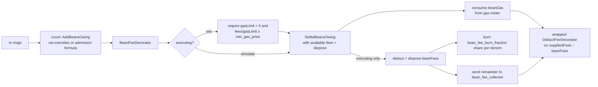

# Beans v2 as a governance-tunable deflationary mechanism

| | |
| --- | --- |
| Status | draft |
| Date | 2026-07-07 |
| Scope | `golang/cosmos/x/swingset`, `golang/cosmos/ante`, `packages/cosmic-swingset` |

## Problem

SwingSet already bills asynchronous JS work in *beans*, a unit distinct from
Cosmos gas. The cosmos-side fee path today has three properties this design
changes:

1. **Latent, invisible deduction.** `Keeper.ChargeBeans`
   (`golang/cosmos/x/swingset/keeper/keeper.go`) accrues a per-address
   `beansOwing` balance in vstorage and only debits coins when the balance
   crosses an integer multiple of `beans_per_unit["minFeeDebit"]`
   (default 2e11 beans, roughly $0.20). The debit is a bank send from the
   signer to the `vbank/reserve` module account
   (`vbanktypes.ReservePoolName`, wired as the SwingSet keeper's
   `feeCollectorName` in `golang/cosmos/app/app.go`). The client signs a tx
   whose `fee` field says nothing about this; some later transaction
   crosses the threshold and pays for its predecessors.
2. **Charge shape is code, not parameters.** The bean *prices* are already
   governance parameters (`Params.BeansPerUnit`, `Params.FeeUnitPrice` in
   `golang/cosmos/proto/agoric/swingset/swingset.proto`, mutable via a
   param-change proposal with no software upgrade), but the *formula* and
   the set of message types it covers are hardcoded: `chargeAdmission`
   (`golang/cosmos/x/swingset/types/msgs.go`) charges
   `inboundTx + message×count + messageByte×bytes + storageByte×storage`,
   and only for messages implementing `vm.ControllerAdmissionMsg`
   (`MsgDeliverInbound`, `MsgWalletAction`, `MsgWalletSpendAction`,
   `MsgInstallBundle`, chunk messages). Charging a non-SwingSet message
   type, or re-weighting one message type, requires an upgrade.
3. **No burn.** Proceeds always land in `vbank/reserve`. There is no
   governance-selectable disposition, so the mechanism cannot be made
   deflationary without an upgrade.

## Requirements

1. All deflation-related parameters tunable by staker governance, no
   software upgrade required.
2. Per-message-type overrides, a parameter such as `msg_type_bean_overrides`
   letting different message types carry different bean charges.
3. Bean fees folded into simulation and gas estimation so clients see the
   combined cost before signing.
4. Deduction happens before standard Cosmos processing, with proceeds
   burned or redirected per a governance parameter.

## Design

Counting stays an accounting-only act against the existing `beansOwing`
balance, and the deduction moves into the ante handler, expressed in
gas-meter terms. `ChargeBeans` splits into `AddBeansOwing` (track debt,
never touch the bank) and `SettleBeansOwing` (settle the debt at the
ante-handler charging point through its caller-supplied disposition). A
minimum-gas-price
parameter ties the two worlds together: during simulation it translates
bean fees into extra `gas_used` so the client's estimate covers them;
during execution it is an enforced floor on the tx's effective gas price,
so the extra gas consumed corresponds to real fee value. The bean
calculations currently hardcoded in Go migrate into
`msg_type_bean_overrides` entries, so the formula itself — not just its
prices — becomes a governance parameter.

### New `x/swingset` parameters

Extend `Params` in `swingset.proto` (all reachable through the existing
legacy `x/params` subspace, `ParamKeyTable` in
`golang/cosmos/x/swingset/types/params.go`, so requirement 1 is satisfied
by the same param-change proposal path that already governs
`beans_per_unit`). The module stays on the legacy `x/params` subspace for
now; a separate comprehensive update PR migrates the module to
`MsgUpdateParams`, so this design does not take that on:

```protobuf
// Per-message-type bean charges, keyed by proto type URL. Each entry is a
// self-contained PRICE MENU for that message type: a matching entry
// REPLACES the default admission formula, and every [unit, value] pair is
// read as `value` beans charged per occurrence of `unit` (1 for `message`,
// the byte count for `messageByte`, …) with NO scaling by the global
// `beans_per_unit` rate. A pair `[unit, "0"]` removes that unit's
// influence on the cost entirely. An entry may also name a message type
// that carries no default admission charge at all (for example
// "/cosmos.distribution.v1beta1.MsgWithdrawDelegatorReward"), which
// introduces a bean charge for a message that is otherwise free.
repeated MsgTypeBeans msg_type_bean_overrides = 11;

// Disposition of collected bean fees: the fraction burned PER DENOM, with
// the remainder sent to bean_fee_collector. DecCoins (the cosmos-sdk type
// `cosmos.base.v1beta1.DecCoin` repeated, Go `sdk.DecCoins` — already used
// in this file via sdk.NewDecCoinsFromCoins), so a native denom like BLD
// can burn while e.g. USDC, which is an IBC-transferred asset from an
// external chain, does not. Each denom's
// decimal is a burn fraction in [0,1]; a denom absent from the list burns
// nothing. Default [] (burn nothing) preserves current behavior.
repeated cosmos.base.v1beta1.DecCoin bean_fee_burn_fraction = 12;

// Module account receiving the unburned remainder.
// Default "vbank/reserve" preserves current behavior.
string bean_fee_collector = 13;

// Minimum gas price, DecCoins (`cosmos.base.v1beta1.DecCoin` repeated).
// Dual role: during simulation it translates bean fees into extra gas
// (gas += bean fee ÷ min_gas_price) so the client's (gas × gas-price)
// estimate covers the bean deduction; during execution it is an enforced
// floor on supplied_fees / supplied_gas_limit, so the bean gas counted
// against the meter corresponds to at least the bean fee in real coins.
// Cosmos-sdk today exposes only a NODE-LOCAL `minimum-gas-prices` server
// config (set to "0ubld" in golang/cosmos/daemon/cmd/root.go), which is
// per-validator and not a chain-consensus value, so there is nothing to
// reuse; this is a dedicated governance param. Named `min_gas_price`
// (not `bean_gas_price`) so a future consensus-level min gas price can
// subsume it.
repeated cosmos.base.v1beta1.DecCoin min_gas_price = 14;
```

`MsgTypeBeans` is `{ string msg_type_url; repeated StringBeans beans; }`,
reusing the existing `StringBeans` shape so JS mirrors
(`packages/cosmic-swingset/src/sim-params.js`, which today mirrors
`default-params.go`) extend naturally.

### Splitting `ChargeBeans`: counting is accounting, charging is in ante

Today the charge rides `AdmissionDecorator` → `CheckAdmissibility` →
`chargeAdmission` → `ChargeBeans`, which both tracks the debt and (past
the `minFeeDebit` threshold) moves coins. Split
`Keeper.ChargeBeans` (`golang/cosmos/x/swingset/keeper/keeper.go`) in two:

- **`AddBeansOwing(ctx, addr, msgType, unit, amount)`** — accounting
  only: record bean debt in the `x/swingset` KVStore (`beansOwing`),
  never touch a bank account. The `msgType`/`unit` arguments let the
  keeper consult `msg_type_bean_overrides` (a matching entry is a
  price menu that replaces the default per-unit price for that message
  type) and emit a typed provenance event per charge.
- **`SettleBeansOwing(ctx, addr, feeBudget, dispose) error`** — settle the
  address's `beansOwing` record, where `feeBudget` is immutable `sdk.Coins`
  (or `nil` during simulation) and `dispose` has type
  `func(beanGas uint64, beanFees sdk.Coins) error`. It drains the
  accumulated balance down to dust or nothing (rather than waiting for the
  `minFeeDebit` threshold), but changes the record only after its caller
  accepts the calculated charge. `fee_unit_price` is an ordered menu of
  interchangeable fee quanta, not one composite multi-denom price. In
  abstract pseudocode:

  ```text
  feeUnits = beansOwing / beans_per_unit["feeUnit"]
  if feeBudget == nil:
      # Simulation quotes the whole debt in the first positive-priced denom.
      beanFees = quoteFeeInPreferredDenom(feeUnits, fee_unit_price)
  else:
      beanFees = selectFeeQuantaFromBudget(
          feeUnits, fee_unit_price, feeBudget)
  if beanFees is an error:
      return insufficient funds

  beanGas = 0
  for each nonzero coin in beanFees:
      price = min_gas_price[coin.denom]
      if price <= 0:
          return invalid min_gas_price configuration
      beanGas += ceil(coin.amount / price)

  if err = dispose(beanGas, beanFees); err != nil:
      return err
  beansOwing -= feeUnits * beans_per_unit["feeUnit"]
  return nil
  ```

  `selectFeeQuantaFromBudget` makes the menu semantics and its mutation
  boundary explicit:

  ```text
  selectFeeQuantaFromBudget(feeUnits, feeQuantumPrices, feeBudget):
      remainingFees = mutable copy of feeBudget
      remainingFeeUnits = feeUnits
      beanFees = empty Coins
      for each positive quantum price in feeQuantumPrices, in preference order:
          payableUnits = min(
              remainingFeeUnits,
              remainingFees[price.denom] / price.amount)
          payment = payableUnits * price.amount
          if payment == 0:
              continue
          beanFees[price.denom] += payment
          remainingFees[price.denom] -= payment
          remainingFeeUnits -= payableUnits
          if remainingFeeUnits == 0:
              return beanFees
      return insufficient funds

  quoteFeeInPreferredDenom(feeUnits, feeQuantumPrices):
      firstPrice = first positive quantum price in preference order
      if firstPrice is absent:
          return invalid fee_unit_price configuration
      return Coins(firstPrice.denom, firstPrice.amount * feeUnits)
  ```

  Thus each selected denom can pay part of the total fee-unit debt, while a
  quantum itself is never underfunded. The helper returns only the selected
  `beanFees` (or an error); its mutable `remainingFees` copy never escapes.

  Thus the keeper neither moves coins nor consumes gas itself. The caller
  implements that policy in `dispose` (consume the gas, deduct the fee,
  burn, redirect). The whole-number conversion deliberately leaves fewer
  than one fee unit of beans as dust.

All `vm.ControllerAdmissionMsg` implementations switch from `ChargeBeans`
to `AddBeansOwing` — admission keeps *counting* exactly where it counts
today (so per-message data like byte and storage sizes are in hand), but
no longer charges. Message types with an `msg_type_bean_overrides` entry
but no admission path (arbitrary Cosmos messages such as
`MsgWithdrawDelegatorReward`) are counted by the ante decorator itself,
which iterates `tx.GetMsgs()` and keys `sdk.MsgTypeURL(msg)` into the
overrides (requirement 2: any message type can carry a charge).

Because `SettleBeansOwing` drains the *whole* balance, it also sweeps
debt accrued under the old batching model by earlier transactions — the
`minFeeDebit` threshold stops governing tx-submitter charges the moment
this lands, with no state migration.

#### Every `ChargeBeans` caller, retargeted

There are exactly two live `ChargeBeans` call sites in non-test code; each
becomes bean accounting. `BeanFeeDecorator` is the single place that calls
`SettleBeansOwing` after those calls have recorded the transaction's debt:

- **`chargeAdmission`** (`golang/cosmos/x/swingset/types/msgs.go`) — the
  admission formula for `vm.ControllerAdmissionMsg` types. Its per-unit
  `beans.Add(...)` accumulation becomes `AddBeansOwing` calls; the trailing
  `keeper.ChargeBeans(...)` is dropped, because the tx's ante
  `BeanFeeDecorator` now performs the conversion via `SettleBeansOwing`.
- **`AddBeansOwingForSmartWallet`** (`golang/cosmos/x/swingset/keeper/keeper.go`,
  reached from `checkSmartWalletProvisioned` during wallet-action
  admission) — renamed from `ChargeForSmartWallet` because it only calls
  `AddBeansOwing` for `beans_per_unit["smartWalletProvision"]`. It does not
  call `SettleBeansOwing`; the same transaction's `BeanFeeDecorator` drains
  the accumulated debt.

`ChargeForProvisioning` / `calculateFees` (`PowerFlagFees`) is **not** a
`ChargeBeans` caller — it moves coins directly with
`SendCoinsFromAccountToModule` and is already coin-denominated — so it is
untouched (see Out of scope). The `SwingSetKeeper` interface
(`expected_keepers.go`) and generated mocks update to expose
`AddBeansOwing`/`SettleBeansOwing` alongside (or in place of) `ChargeBeans`.

### `BeanFeeDecorator`: enforcement and disposition (requirement 4)

The builtin Cosmos SDK `DeductFeeDecorator`
(`ante.NewDeductFeeDecoratorWithName`) is **removed from the ante chain**
in `golang/cosmos/ante/ante.go`. In its place, a new `BeanFeeDecorator`
**explicitly wraps** the builtin decorator — it constructs the builtin
`DeductFeeDecorator` internally and calls it directly. This gives the bean
logic a place to stand: it can convert and dispose of `beanFees` and then
hand the builtin decorator `suppliedFees − beanFees`, so the builtin
operates on the net-of-beans fee without any modification to the
decorator-chain driver (`sdk.ChainAnteDecorators`) or to the builtin
decorator itself.

Ordering follows from the wrap: the admission/counting controllers run
first (so `AddBeansOwing` has recorded the debt), then `BeanFeeDecorator`
runs a single, self-contained "convert beans, then deduct the net fee"
stage. The admission-counting decorator therefore moves ahead of
`BeanFeeDecorator` in the chain; because `BeanFeeDecorator` wraps the
builtin, no further chain reordering is needed to interleave bean
conversion with fee deduction.



- **Floor check (executing only):** require `suppliedGasLimit > 0` and
  effective gas price `suppliedFees / suppliedGasLimit ≥ min_gas_price`.
  This is what makes the gas-meter expression of bean fees sound: gas
  consumed at a floored price is worth at least the corresponding coins.
- **Convert and dispose:** call
  `swingsetKeeper.SettleBeansOwing(ctx, feePayer, suppliedFees, dispose)`.
  Its `dispose` callback counts `beanGas` against the context's gas meter
  (so the bean charge occupies part of the supplied gas limit), then applies
  the execution-only fee disposition below. If either action fails, the
  keeper leaves `beansOwing` unchanged.
- **Dispose (executing only):** deduct `beanFees` from the fee payer and
  split it per params — for each denom, `bean_fee_burn_fraction`'s share
  of the coins destroyed with `BankKeeper.BurnCoins` via the `x/swingset`
  module account (the deflationary arm), the remainder forwarded
  `SendCoinsFromModuleToModule` to `bean_fee_collector` (default
  `vbank/reserve`; other useful values: `authtypes.FeeCollectorName` so
  vbank's reward smoothing pays validators, or `vbank/giveaway`).
  Insufficient funds reject the tx up front instead of mid-execution.
- **Deduct the net fee:** invoke the wrapped builtin `DeductFeeDecorator`
  on `suppliedFees − beanFees`, so the standard Cosmos fee deduction never
  double-charges the bean portion.
- **Transparency events:** the decorator emits a typed event per charge
  (msg type URL, beans, coins, disposition split) so explorers and
  wallets can display what was deducted and why.

The fee payer is charged for all of this synchronous work. Because bean
fees are folded into the gas simulation (below), the automatic gas
estimate the client signs already covers them, so charging the tx fee
payer — the same account that pays Cosmos gas, and that can be a feegrant
— is correct and needs no per-message submitter bookkeeping. (If later
work adds *asynchronous* bean accounting and conversion with no signing
tx to attribute, deciding which account it bills is a separate problem to
solve then.)

### Simulation and gas estimates (requirement 3)

`AdmissionDecorator.AnteHandle` already special-cases `simulate` (it
swallows admission errors "otherwise our gas estimation will be too
low"). Under `simulate`, `BeanFeeDecorator` passes `nil` as `feeBudget`,
skips the floor check and all bank movements, and still calls
`SettleBeansOwing` with a simulation `dispose` callback that consumes `beanGas`
(`beanGas = bean fee coins ÷ min_gas_price`) — so the standard Cosmos
simulate RPC returns a `gas_used` that already includes the bean charge.
A client that multiplies that estimate by its own gas price (which the
execution-time floor forces to be at least `min_gas_price`) covers the
bean fee with no new API; existing wallets see the combined fee up
front. The simulate response's message logs additionally carry the typed
charge event for clients that want to itemize.

### Exemptions

The exemptions that exist today continue to be allowed. Privileged
provisioning via the `provisionpass` balance (`privilegedProvisioningCoins`
in `golang/cosmos/x/swingset/keeper/keeper.go`) and existing
high-priority-queue carve-outs keep waiving SwingSet message charges as
they do now. A governance-set override charge on an arbitrary Cosmos
message type (say `MsgWithdrawDelegatorReward`) rides the ante path and is
not subject to those SwingSet-specific carve-outs, but the SwingSet
message charges retain their existing exemptions unchanged.

### Migration

- Genesis/upgrade default: `msg_type_bean_overrides = []`,
  `bean_fee_burn_fraction = []`, `bean_fee_collector = "vbank/reserve"`,
  `min_gas_price` unset (simulation folding and floor off). With those
  defaults the chain behaves exactly as today; every deviation is a later
  governance act.
- **Go formula → params:** migrate the bean
  calculations currently hardcoded in `x/swingset` Go into equivalent
  `msg_type_bean_overrides` entries — the upgrade handler (or genesis for
  new chains) seeds one entry per `vm.ControllerAdmissionMsg` type,
  pairing the units `chargeAdmission` charges today (`inboundTx`,
  `message`, `messageByte`, `storageByte`) with their current
  `beans_per_unit` prices. From then on re-weighting or dropping a
  message type's charge is a param change, no software upgrade
  (requirement 1 applied to the formula, not just the prices). The
  hardcoded formula remains only as the fallback for types with no
  override entry — or is deleted once the seeding is trusted.
- `UpdateParams` in `golang/cosmos/x/swingset/types/params.go` already
  appends missing entries with defaults; the new fields follow the same
  pattern, so the upgrade handler needs no bespoke state migration beyond
  the seeding above.
- JS mirror: extend `sim-params.js` and the `ParamsSDKType` usage in
  `packages/cosmic-swingset` so simulated chains exercise the same shape.

### Open question: existing `fee_unit_price` semantics and compatibility

Before implementation, confirm how the live `FeeUnitPrice` parameter and
historical governance values interpret more than one denom. The new ordered
menu reading must not silently reinterpret a live composite-price value. The
compatibility heuristic is conservative: a singleton positive-denom value has
the same unambiguous meaning and can be carried forward; a multi-denom value
requires an explicit governance choice of menu order and prices before the
new settlement path is enabled. Inspect the active parameter and historical
param-change proposals before proposing that conversion. Keeping the field
name avoids needless API churn, but does not by itself establish semantic
compatibility.

## Out of scope

- Computron accounting (`xsnapComputron`, `blockComputeLimit`,
  `vatCreation` beans consumed by `computronCounter` in
  `packages/cosmic-swingset/src/launch-chain.js`): that is a block run
  policy, not a per-account fee, and is untouched here.
- `PowerFlagFees` provisioning fees (`ChargeForProvisioning`,
  `calculateFees`): already coin-denominated parameters, and not a
  `ChargeBeans` caller; unchanged.
- Contract-level (Zoe/IST) fee policy: this design is chain-layer only.
- Migrating `x/swingset` off the legacy `x/params` subspace to
  `MsgUpdateParams`: handled by a separate comprehensive update PR.

## Resolved review decisions

The following points, raised as open questions in earlier drafts, were
decided in review and are now settled in the design above:

- **Override entry semantics.** Each override entry is a per-message-type
  price menu: `value` beans per occurrence of `unit`, with no scaling by
  the global `beans_per_unit` rate. `[unit, "0"]` removes that unit's
  influence on the cost.
- **Interplay with the builtin `DeductFeeDecorator`.** The builtin is
  removed from the chain and wrapped by `BeanFeeDecorator`, which feeds it
  `suppliedFees − beanFees`; the net-of-beans reading avoids
  double-charging.
- **Decorator ordering.** Because `BeanFeeDecorator` wraps the builtin,
  the chain needs only "admission controllers, then `BeanFeeDecorator`";
  no other chain-driver modification is required.
- **Minimum gas price.** A dedicated `min_gas_price` DecCoins param (no
  chain-consensus min gas price exists to reuse; the cosmos-sdk
  `minimum-gas-prices` is node-local only).
- **Residual `beansOwing` charges.** `BeanFeeDecorator` calls
  `SettleBeansOwing(ctx, addr, suppliedFees, dispose)` after every
  transaction's accounting calls,
  draining as much of the address's accumulated bean debt as possible to
  coins immediately (leaving dust), so no charge waits for the old
  threshold-debit.
- **Fee-unit price selection.** `fee_unit_price` is an ordered menu of
  interchangeable fee quanta. Execution selects enough whole quanta from
  the immutable fee budget in preference order; simulation supplies no
  budget and quotes the entire debt in the first positive-priced denom.
- **Burn per-denom.** `bean_fee_burn_fraction` is DecCoins, so the burn
  fraction is per-denom (a native denom like BLD burns, an
  IBC-transferred asset like USDC need not).
- **Lingering `ChargeBeans` callers.** The two live callers
  (`chargeAdmission`, `ChargeForSmartWallet`, renamed
  `AddBeansOwingForSmartWallet`) are retargeted to bean accounting only;
  `BeanFeeDecorator` is the sole `SettleBeansOwing` caller.
- **Fee-payer identity.** Synchronous work charges the tx fee payer, which
  the automatic gas simulation has already estimated; async attribution is
  deferred to future work.
- **Parameter plumbing.** Stay on the legacy `x/params` subspace for now;
  a separate PR migrates to `MsgUpdateParams`.
