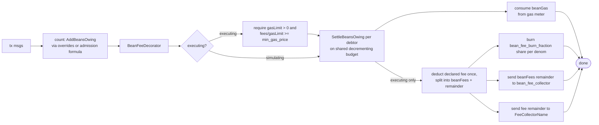

# Beans v2 as a governance-tunable deflationary mechanism

**Status:** draft

**Date:** 2026-09-04

**Scope:** `golang/cosmos/x/swingset`, `golang/cosmos/ante`,
`packages/cosmic-swingset`

## Problem

SwingSet already bills asynchronous JS work in *beans*, a unit distinct from
Cosmos gas. Two Cosmos-side stages recur throughout this design. *Admission*
is SwingSet's inbound-message gate: the `AdmissionDecorator` that today both
counts and charges beans for `vm.ControllerAdmissionMsg` messages. The *ante
handler* is Cosmos's ordered chain of decorators that runs on every
transaction before its messages execute (signature verification, fee
deduction, and admission counting are all links in that chain). The
Cosmos-side fee path today has three properties this design changes:

1. **Latent, invisible deduction.** `Keeper.ChargeBeans`
   (`golang/cosmos/x/swingset/keeper/keeper.go`) accrues a per-address
   `beansOwing` balance in vstorage and only debits coins when the balance
   crosses an integer multiple of `beans_per_unit["minFeeDebit"]`
   (default 200 billion beans, roughly $0.20). The debit is a bank send
   from the signer to the `vbank/reserve` module account
   (`vbanktypes.ReservePoolName`, wired as the SwingSet keeper's
   `feeCollectorName` in `golang/cosmos/app/app.go`). The client signs a tx
   whose `fee` field says nothing about this; some later transaction
   crosses the threshold and pays for its predecessors.
2. **Charge shape is code, not parameters.** The bean *prices* are already
   governance parameters (`Params.BeansPerUnit`, `Params.FeeUnitPrice` in
   `golang/cosmos/proto/agoric/swingset/swingset.proto`, mutable via a
   param-change proposal with no software upgrade), but the coefficients of
   the charging formula and the set of message types it covers are
   hardcoded: `chargeAdmission`
   (`golang/cosmos/x/swingset/types/msgs.go`) charges
   `inboundTx + message*count + messageByte*bytes + storageByte*storage`,
   and only for messages implementing `vm.ControllerAdmissionMsg`
   (`MsgDeliverInbound`, `MsgWalletAction`, `MsgWalletSpendAction`,
   `MsgInstallBundle`, chunk messages). Charging a non-SwingSet message
   type, or re-weighting one message type, requires an upgrade.
3. **No burn, so no deflation.** Proceeds always land in `vbank/reserve`.
   There is no governance-selectable disposition. *Deflationary* here means
   the option to destroy a governance-chosen fraction of the collected fee
   coins with `BankKeeper.BurnCoins`, permanently removing them from the
   denom's circulating supply rather than recirculating them through the
   reserve. A chain may want this to counteract issuance or to return value
   to holders, and today it cannot without a software upgrade.

## Requirements

1. All deflation-related parameters are tunable by staker governance with
   no software upgrade required (bounded by the machinery the landing
   upgrade ships, see *Software-upgrade prerequisites*).
2. Per-message-type overrides let different message types carry different
   bean charges, through a parameter such as `msg_type_bean_overrides`.
3. Bean fees are folded into simulation and gas estimation so clients see
   the combined cost before signing.
4. Deduction happens before standard Cosmos fee handling, with proceeds
   burned or redirected per a governance parameter.

## Design

Counting becomes an accounting-only act against the existing `beansOwing`
balance, and the deduction moves into the ante handler, expressed in
gas-meter terms. The unit chain the whole design rests on, stated once up
front:

- **beans** divide by `beans_per_unit["feeUnit"]` to give **fee units**;
- **fee units** multiply by a **fee quantum price** (`fee_unit_price` or an
  alternative) to give **coins**;
- **coins** divide by `min_gas_price` to give the extra **gas** folded into
  the estimate.

`ChargeBeans` splits into `AddBeansOwing` (track debt, never touch the bank)
and `SettleBeansOwing` (settle the debt at the ante-handler charging point
through its caller-supplied disposition). A dedicated boolean parameter,
`bean_ante_mode`, is the master switch that selects between the two worlds;
`min_gas_price` is only the conversion rate (and, in execution, the enforced
floor), never itself the switch. When `bean_ante_mode` is on, simulation
translates bean fees into extra `gas_used` so the client's estimate covers
them, and execution enforces `min_gas_price` as a floor on the tx's effective
gas price so the extra gas consumed corresponds to real fee value. When it is
off (the migration default) the ante-folded mechanism is inert and the module
keeps today's threshold-debit behavior exactly (see *Migration*).

Note the scope this default draws: the landing upgrade *ships the mechanism*
but leaves it off, so Problem 1 (the latent, invisible deduction) is resolved
only for a chain whose governance turns `bean_ante_mode` on. Until then the
invisible threshold-debit persists byte-for-byte; this PR delivers the switch
and the machinery it arms, not a chain-wide behavior change on upgrade.

The per-message-type *coefficients* currently hardcoded in Go migrate into
`msg_type_bean_overrides` entries, so the coefficients of the charge, not
just the global prices, become governance parameters. The *basis* those
coefficients weight (which units a message type emits, and how they are
measured) stays in Go: an override can only re-price units the counting path
already emits for that message type.

### New `x/swingset` parameters

Extend `Params` in `swingset.proto` (all reachable through the existing
legacy `x/params` subspace, `ParamKeyTable` in
`golang/cosmos/x/swingset/types/params.go`, so requirement 1 is satisfied
by the same param-change proposal path that already governs
`beans_per_unit`). The module stays on the legacy `x/params` subspace for
now; a separate comprehensive update PR migrates the module to
`MsgUpdateParams`, so this design does not take that on.

```protobuf
// Per-message-type bean charges, keyed by proto type URL. Each entry is a
// self-contained price menu for that message type: a matching entry
// replaces the default admission formula, and every [unit, value] pair is
// read as `value` beans charged per occurrence of `unit` (1 for `message`,
// the byte count for `messageByte`, and so on) with no scaling by the
// global `beans_per_unit` rate. A pair `[unit, "0"]` removes that unit's
// influence on the cost entirely. An entry may also name a message type
// that carries no default admission charge at all (for example
// "/cosmos.distribution.v1beta1.MsgWithdrawDelegatorReward"), which
// introduces a bean charge for a message that is otherwise free, but only
// for the units the ante counter can measure for that type (see the Design
// section on counting arbitrary message types).
repeated MsgTypeBeans msg_type_bean_overrides = 11;

// Disposition of collected bean fees: the fraction burned per denom, with
// the remainder sent to bean_fee_collector. The type is DecCoins (the
// cosmos-sdk type `cosmos.base.v1beta1.DecCoin` repeated, Go sdk.DecCoins,
// already used in this file via sdk.NewDecCoinsFromCoins), so that coins of
// a native denom like BLD can be burned while an IBC-transferred asset like
// USDC is not. Each denom's decimal is a burn fraction and MUST validate in
// [0,1] (see Parameter validation); a denom absent from the list burns
// nothing. Default [] (burn nothing) preserves current behavior.
repeated cosmos.base.v1beta1.DecCoin bean_fee_burn_fraction = 12;

// Module account receiving the unburned remainder. It MUST name an existing
// module account (see Parameter validation). Default "vbank/reserve"
// preserves current behavior.
string bean_fee_collector = 13;

// Minimum gas price, DecCoins (`cosmos.base.v1beta1.DecCoin` repeated). This
// is only the conversion rate and floor for the ante-folded model, never the
// switch that selects it (that is `bean_ante_mode`, field 16). When
// `bean_ante_mode` is on it plays two coupled roles: during simulation it
// translates bean fees into extra gas (gas += bean fee / min_gas_price) so
// the client's (gas * gas-price) estimate covers the bean deduction; during
// execution it is an enforced floor on supplied_fees / supplied_gas_limit,
// so the bean gas counted against the meter corresponds to at least the bean
// fee in real coins. Because one value serves as both rate and floor, an
// operator who wants the ante-folded model cannot also waive the floor; that
// is an accepted coupling of a single "price of gas" concept, not a mode
// selector (see Parameter validation). Cosmos SDK today exposes only a
// node-local `minimum-gas-prices` server config (set to "0ubld" in
// golang/cosmos/daemon/cmd/root.go), which is per-validator and not a
// chain-consensus value, so there is nothing to reuse; this is a dedicated
// governance param. Named `min_gas_price` (not `bean_gas_price`) so a
// future consensus-level min gas price can subsume it. Ignored while
// `bean_ante_mode` is off; required non-empty when it is on.
repeated cosmos.base.v1beta1.DecCoin min_gas_price = 14;

// The master switch for the ante-folded model, kept separate from
// `min_gas_price` so mode selection and the gas rate are two independent
// operator decisions (a rate of zero is a legitimate value in the enabled
// mode and must not read as "unset", and `sdk.DecCoins` sanitizes zero-amount
// coins away in any case). False (default) leaves the module in legacy
// threshold-debit mode; true activates the ante-folded model, at which point
// `min_gas_price` must be non-empty.
bool bean_ante_mode = 16;

// A complete substitute price for one fee quantum. The wrapper preserves
// the existing fee_unit_price wire shape (a repeated Coin) for each
// alternative.
message FeeUnitPriceAlternative {
  repeated cosmos.base.v1beta1.Coin price = 1
      [(gogoproto.castrepeated) = "github.com/cosmos/cosmos-sdk/types.Coins", (gogoproto.nullable) = false];
}

// Complete substitute prices, in descending preference after
// fee_unit_price. Empty by default, which preserves the existing
// fee_unit_price behavior.
repeated FeeUnitPriceAlternative fee_unit_price_alternatives = 15;
```

`MsgTypeBeans` is `{ string msg_type_url; repeated StringBeans beans; }`,
reusing the existing `StringBeans` shape so JS mirrors
(`packages/cosmic-swingset/src/sim-params.js`, which today mirrors
`default-params.go`) extend naturally.

### Parameter validation

Every existing `Params` field has a `validateX` in `params.go` wired into
both `ParamKeyTable` and `ValidateBasic`; the five new fields follow the
same convention. Three constraints the chosen types cannot express on their
own get hand-written validators, each rejecting the value at param-set time
rather than at consensus time:

- `validateBeanFeeBurnFraction`: every entry's decimal is in `[0,1]`.
  `DecCoins` alone permits values above 1.
- `validateBeanFeeCollector`: names a module account known to `maccPerms`.
  A typo would otherwise reach `SendCoinsFromModuleToModule`, which panics
  on an unknown module account at consensus time.
- `validateMinGasPrice`/`validateFeeUnitPriceAlternatives`: prices are
  well-formed, non-negative `DecCoins`/`Coins`; a fee-quantum denom absent
  from `min_gas_price` converts to zero bean gas for that denom (which is
  defined, not an error, but is documented so operators understand the
  coupling: the `beanGas` loop iterates the settled `beanFees` coins and
  skips any whose denom `min_gas_price` does not price).
- `ValidateBasic` cross-field check: when `bean_ante_mode` is true,
  `min_gas_price` must be non-empty (the ante-folded model has no conversion
  rate otherwise). `bean_ante_mode` false imposes no constraint on
  `min_gas_price`.

The `bean_fee_burn_fraction` field reuses `DecCoins` to carry a
dimensionless ratio, which is a deliberate wire-compatibility choice (the
type already appears in this file and mirrors cleanly to JS). Its decimal
field renders as `amount`, which is not an amount; the validator above is
what enforces the ratio semantics the type does not.

### Splitting `ChargeBeans`: counting is accounting, charging is in ante

Today the charge rides `AdmissionDecorator` -> `CheckAdmissibility` ->
`chargeAdmission` -> `ChargeBeans`, which both tracks the debt and (past
the `minFeeDebit` threshold) moves coins. Split
`Keeper.ChargeBeans` (`golang/cosmos/x/swingset/keeper/keeper.go`) into an
accounting function and two settlement functions, one per mode, so that no
single signature carries two contracts selected by hidden config:

- **`AddBeansOwing(ctx, addr, msgType, unit, count)`** performs
  accounting only: record bean debt under `addr` in the `x/swingset` KVStore
  (`beansOwing`), never touch a bank account. `count` is the occurrence
  count of `unit` (1 for `message`, the byte count for `messageByte`, and
  so on), matching the `chargeAdmission` counting it replaces, not a bean
  quantity. The `msgType`/`unit` arguments let the keeper consult
  `msg_type_bean_overrides` (a matching entry is a price menu that replaces
  the default per-unit price for that message type) and emit a typed
  provenance event per charge.
- **`SettleBeansOwingLegacy(ctx, addr) error`** is the legacy-mode
  settlement, reached only when `bean_ante_mode` is off. It is exactly the
  coin-moving tail of today's `ChargeBeans`: debit the debtor's *account
  balance* to `bean_fee_collector` only when `beansOwing` crosses the
  `minFeeDebit` threshold, with no fee budget, no burn, no floor check, and
  no gas folding. `feeBudget`, `dispose`, and `beanGas` have no meaning on
  this path and it takes none of them, so its contract cannot be confused
  with the ante-mode function's.
- **`SettleBeansOwing(ctx, addr, feeBudget, simulate, dispose) error`** is
  the ante-mode settlement, reached only when `bean_ante_mode` is on. It
  settles the `beansOwing` record keyed by `addr`, the same identity
  `AddBeansOwing` recorded (see *Debtor identity versus fee payer* below),
  and it never touches an account balance: every coin movement is delegated
  to `dispose`, which draws from `feeBudget`. `feeBudget` is immutable
  `sdk.Coins`, `simulate` is an explicit boolean (not inferred from a nil
  budget, since the zero value of `sdk.Coins` is legitimately nil), and
  `dispose` has type `func(beanGas uint64, beanFees sdk.Coins) error`. It
  drains the accumulated balance down to dust or nothing (rather than
  waiting for the `minFeeDebit` threshold), but changes the record only
  after its caller accepts the calculated charge. `fee_unit_price` remains
  one composite
  `sdk.Coins` price for a fee quantum, preserving its current meaning.
  `fee_unit_price_alternatives` is an ordered `[]sdk.Coins` list of complete
  substitute prices. The preferred composite price precedes the
  alternatives in the selection order. In abstract pseudocode:

  ```text
  feeUnits = beansOwing / beans_per_unit["feeUnit"]
  feeQuantumPrices = [fee_unit_price, ...fee_unit_price_alternatives]
  if simulate:
      # Simulation quotes the whole debt at the preferred composite price.
      beanFees = quoteFeeAtPrice(feeUnits, fee_unit_price)
  else:
      beanFees = selectFeeQuantaFromBudget(
          feeUnits, feeQuantumPrices, feeBudget)
  if beanFees is an error:
      return insufficient funds

  beanGas = 0
  for each nonzero coin in beanFees:
      price = min_gas_price[coin.denom]
      if price > 0:
          beanGas += ceil(coin.amount / price)

  if err = dispose(beanGas, beanFees); err != nil:
      return err
  beansOwing -= feeUnits * beans_per_unit["feeUnit"]
  return nil
  ```

  `selectFeeQuantaFromBudget` makes the menu semantics and its mutation
  boundary explicit:

  ```text
  selectFeeQuantaFromBudget(feeUnits, feeQuantumPrices, feeBudget):
      remainingFees = mutable copy of feeBudget
      remainingFeeUnits = feeUnits
      beanFees = empty Coins
      for each non-empty quantum price in feeQuantumPrices, in preference order:
          payableUnits = remainingFeeUnits
          for each coin in price:
              payableUnits = min(
                  payableUnits, remainingFees[coin.denom] / coin.amount)
          if payableUnits == 0:
              continue
          payment = scale every coin in price by payableUnits
          beanFees += payment
          remainingFees -= payment
          remainingFeeUnits -= payableUnits
          if remainingFeeUnits == 0:
              return beanFees
      return insufficient funds

  quoteFeeAtPrice(feeUnits, price):
      if price is empty:
          return invalid fee_unit_price configuration
      return scale every coin in price by feeUnits
  ```

  Each selected quantum pays a whole fee unit, so several selected quanta
  cover several whole fee units. Every coin in a composite price is
  required, so a multi-denom `fee_unit_price` cannot be reinterpreted as a
  menu of single-denom choices. The helper returns only the selected
  `beanFees` (or an error); its mutable `remainingFees` copy never escapes.

  The keeper neither moves coins nor consumes gas itself. The caller
  implements that policy in `dispose` (consume the gas, deduct the fee,
  burn, redirect). The whole-number conversion to fee units deliberately
  leaves fewer than one fee unit of beans as dust: up to
  `beans_per_unit["feeUnit"] - 1` beans (up to roughly 1 BLD at the default
  `feeUnit` of 1e12), which is coarser than the old `minFeeDebit`
  granularity of 200 billion beans. That residual is not lost; it stays on
  the debtor's `beansOwing` record and settles on the next transaction that
  drains it. Governance can lower `feeUnit` to tighten the dust bound.

All `vm.ControllerAdmissionMsg` implementations switch from `ChargeBeans`
to `AddBeansOwing`. Admission keeps *counting* exactly where it counts
today (so per-message data like byte and storage sizes are in hand), but
no longer charges. Message types with an `msg_type_bean_overrides` entry
but no admission path (arbitrary Cosmos messages such as
`MsgWithdrawDelegatorReward`) are counted by the ante decorator itself,
which iterates `tx.GetMsgs()` and keys `sdk.MsgTypeURL(msg)` into the
overrides (requirement 2: any message type can carry a charge). The ante
decorator can only measure per-message occurrence for such types (it has
no admission-path byte or storage counts), so an override on a non-admission
type may price only the `message` unit; naming a unit the decorator cannot
measure for that type is inert. To avoid double counting, the ante
decorator skips any message already counted on the admission path.

### Debtor identity versus fee payer

`AddBeansOwing` records debt under the message's charging address (the
submitter or wallet owner, as `chargeAdmission` keys it today).
`SettleBeansOwing` settles the record under that same address. These are
one identity, so a record accrued under a submitter is the record drained,
closing the gap where a feegrant or a multi-owner tx would settle an empty
record and leave the real debt to grow forever.

The tx *fee payer* funds the settlement, which is a distinct role. A single
transaction may charge more than one debtor (a multi-message tx from
several owners, or a submitter distinct from the fee payer under a
feegrant). `BeanFeeDecorator` therefore drains the `beansOwing` of every
distinct address charged by the tx's messages and funds the total from the
one tx fee payer, resolving a feegrant through
`feegrantKeeper.UseGrantedFees` exactly as the standard fee path does. The
fee payer pays for the work the transaction causes, including bean debts
recorded against the accounts it acts for.

The single declared fee is one budget shared by all debtors, not one budget
per debtor. `BeanFeeDecorator` threads a *decrementing* remaining budget
through the per-debtor settlements: debtor *n* draws from what debtors *0..n-1*
left, so the debtors together can select at most the whole declared fee, never
a multiple of it. And the actual coin movement (deduct the declared fee from
the fee payer once, then split it) is hoisted out of the per-debtor loop and
runs a single time after every debtor has been priced against the shared
budget. The per-debtor `dispose` accumulates the beans-to-coins result; it
does not itself deduct from the fee payer.

### `BeanFeeDecorator`: enforcement and disposition (requirement 4)

The built-in Cosmos SDK `DeductFeeDecorator`
(`ante.NewDeductFeeDecoratorWithName`) is **removed from the ante chain**
in `golang/cosmos/ante/ante.go`. `BeanFeeDecorator` performs the entire fee
deduction itself rather than delegating to the built-in. This is the crux:
the built-in reads the fee from the transaction (`sdk.FeeTx.GetFee()`), not
from an argument, and re-running it on a net-of-beans amount would require a
synthetic transaction. The signature-verification decorators
(`SetPubKey`/`SigVerification`) re-derive sign bytes from the transaction,
so any mutation of the tx fee fails verification. `BeanFeeDecorator`
therefore never mutates the transaction. Instead it:

1. reads the declared fee and resolves the fee payer or granter from the tx
   the same way the built-in does (`sdk.FeeTx`, feegrant via
   `feegrantKeeper.UseGrantedFees`);
2. computes the total `beanFees` across all charged debtors against the
   *shared* declared fee as the budget, threading a single decrementing
   remaining-budget through each debtor's `SettleBeansOwing` so the debtors
   cannot collectively select more than the declared fee;
3. deducts the full declared fee from the fee payer once (feegrant-aware,
   outside the per-debtor loop), then routes it: the accumulated `beanFees`
   to the burn/redirect disposition below, and the remainder to the standard
   fee collector (`FeeCollectorName`), so the fee payer is charged exactly
   the declared fee and no more.

Because the transaction is never altered, signature verification still
checks the original signed fee, and the mempool `CheckTx` fee and priority
computation (`checkTxFeeWithValidatorMinGasPrices`) still see the full
declared fee, not a net-of-beans amount.

**Ordering.** `AddBeansOwing` must have recorded the debt before
`BeanFeeDecorator` settles it, and admission counting must run only on
*authenticated* transactions: `CheckAdmissibility` reaches the smart-wallet
provisioning path, so running it on unsigned txs is a spam surface. Today
`AdmissionDecorator` already sits after `SetPubKey`/`SigVerification`
(`golang/cosmos/ante/ante.go`), with `IncrementSequence` and
`RedundantRelay` after it, while `DeductFeeDecorator` sits before signature
verification. This design keeps admission counting after signature
verification and moves fee deduction to sit just after it too, ahead of
`IncrementSequence`: the order becomes
`... SetPubKey, SigVerification, admission counting, BeanFeeDecorator, IncrementSequence ...`.
Deducting the fee after signature verification means an unfunded tx pays the
(cheap, metered) signature-verification gas before its fee is taken; that
is an accepted trade for never running the admission controller on
unauthenticated input.

The flow below is the ante-folded path taken when `bean_ante_mode` is on;
the legacy path is described under *Master switch* immediately after.


```mermaid
flowchart LR
  A[tx msgs] --> B["count: AddBeansOwing<br/>via overrides or admission formula"]
  B --> C[BeanFeeDecorator]
  C --> D{executing?}
  D -- executing --> E["require gasLimit > 0 and<br/>fees/gasLimit >= min_gas_price"]
  E --> F["SettleBeansOwing per debtor<br/>on shared decrementing budget"]
  D -- simulating --> F
  F --> G["consume beanGas<br/>from gas meter"]
  F -- executing only --> H["deduct declared fee once,<br/>split into beanFees + remainder"]
  H --> I["burn bean_fee_burn_fraction share per denom"]
  H --> J["send beanFees remainder to bean_fee_collector"]
  H --> L["send fee remainder to FeeCollectorName"]
  G --> K([done])
  I --> K
  J --> K
  L --> K
```

Under simulation the executing-only branch is skipped: `F` consumes
`beanGas` into the gas meter and returns, so no bank movement happens and
the estimate still reflects the bean charge.

- **Master switch:** All of the following applies only when `bean_ante_mode`
  is on. With it off the decorator takes the legacy path: it performs the
  ordinary Cosmos fee deduction that the removed built-in `DeductFeeDecorator`
  used to perform (deduct the full declared fee from the fee payer to
  `FeeCollectorName`, feegrant-aware, with mempool priority preserved, see
  *Ordering*), then calls `SettleBeansOwingLegacy` per debtor for the
  threshold account-balance bean debit; none of the floor check, gas folding,
  burn, or `bean_fee_collector` split runs (see *Migration*). Because
  `DeductFeeDecorator` is removed unconditionally, this ordinary-fee-deduction
  duty is what keeps legacy mode paying Cosmos fees at all.
- **Floor check (executing only):** require `suppliedGasLimit > 0` and
  effective gas price `suppliedFees / suppliedGasLimit >= min_gas_price`.
  This is what makes the gas-meter expression of bean fees sound: gas
  consumed at a floored price is worth at least the corresponding coins.
- **Convert and dispose:** for each charged debtor `addr`, call
  `swingsetKeeper.SettleBeansOwing(ctx, addr, remainingBudget, simulate, dispose)`,
  where `remainingBudget` starts at the whole declared fee and is decremented
  by each debtor's selected `beanFees` before the next debtor is settled (so
  the debtors share one budget, per *Debtor identity versus fee payer*). The
  `dispose` callback counts `beanGas` against the context's gas meter (so the
  bean charge occupies part of the supplied gas limit) and accumulates the
  debtor's `beanFees` into a running total; it does *not* itself move coins
  from the fee payer. If it fails, the keeper leaves that debtor's
  `beansOwing` unchanged.
- **Dispose (executing only), once after the debtor loop:** deduct the
  declared fee from the fee payer a single time and split the accumulated
  `beanFees` per params. For each denom, `bean_fee_burn_fraction`'s
  share of the coins is destroyed with `BankKeeper.BurnCoins` via the
  SwingSet bean-fee module account (the deflationary arm), and the
  remainder is forwarded with `SendCoinsFromModuleToModule` to
  `bean_fee_collector` (default `vbank/reserve`; other useful values:
  `authtypes.FeeCollectorName` so vbank's reward-smoothing distribution pays
  validators, or `vbank/giveaway`). The non-bean remainder of the declared
  fee goes to `FeeCollectorName` as the built-in would have sent it.
  Insufficient funds reject the tx up front instead of mid-execution.
- **Transparency events:** the decorator emits a typed event per charge
  (msg type URL, beans, coins, disposition split) so explorers and
  wallets can display what was deducted and why.

The fee payer is charged for all of this synchronous work. Because bean
fees are folded into the gas simulation (below), the automatic gas
estimate the client signs already covers them, so charging the tx fee
payer (the same account that pays Cosmos gas, resolved through a feegrant
when present) is correct and needs no per-message submitter bookkeeping.
(If later work adds *asynchronous* bean accounting and conversion with no
signing tx to attribute, deciding which account it bills is a separate
problem to solve then.)

#### Software-upgrade prerequisites

The disposition machinery does not exist in the current app wiring, so the
software upgrade that lands this design must ship it. Governance-tunability
(requirement 1) is bounded by that shipped capability: the *parameters* are
tunable with no further upgrade once the machinery is in place, but setting
a nonzero `bean_fee_burn_fraction` before the machinery exists would fail
for every transaction. The upgrade adds:

- **A SwingSet bean-fee module account with `authtypes.Burner`
  permission.** Today `maccPerms` in `golang/cosmos/app/app.go` gives
  `vbanktypes.ReservePoolName` a `nil` permission and defines no swingset
  module account, so `BurnCoins` has no burner to act through. The upgrade
  registers a dedicated module account (holding bean fees transiently
  before burn or redirect) with the `Burner` permission.
- **An expanded `BankKeeper` expected interface.** Today
  `golang/cosmos/x/swingset/types/expected_keepers.go` exposes only
  `GetAllBalances` and `SendCoinsFromAccountToModule`. The upgrade adds
  `BurnCoins` and `SendCoinsFromModuleToModule` (and regenerates the mocks),
  which the disposition path requires.

Until both land, only the default disposition (burn nothing, collect to
`vbank/reserve`) is reachable, which is exactly today's behavior.

#### Every `ChargeBeans` caller, retargeted

There are exactly two live `ChargeBeans` call sites in non-test code; each
becomes bean accounting. `BeanFeeDecorator` is the single place that calls
`SettleBeansOwing` after those calls have recorded the transaction's debt:

- **`chargeAdmission`** (`golang/cosmos/x/swingset/types/msgs.go`) is the
  admission formula for `vm.ControllerAdmissionMsg` types. Its per-unit
  `beans.Add(...)` accumulation becomes `AddBeansOwing` calls; the trailing
  `keeper.ChargeBeans(...)` is dropped, because the tx's ante
  `BeanFeeDecorator` now performs the conversion via `SettleBeansOwing`.
- **`AddBeansOwingForSmartWallet`** (`golang/cosmos/x/swingset/keeper/keeper.go`,
  reached from `checkSmartWalletProvisioned` during wallet-action
  admission) is renamed from `ChargeForSmartWallet` because it only calls
  `AddBeansOwing` for `beans_per_unit["smartWalletProvision"]`. It does not
  call `SettleBeansOwing`; the same transaction's `BeanFeeDecorator` drains
  the accumulated debt.

`ChargeForProvisioning` / `calculateFees` (`PowerFlagFees`) is **not** a
`ChargeBeans` caller. It moves coins directly with
`SendCoinsFromAccountToModule` and is already coin-denominated, so it is
untouched (see *Out of scope*). `ChargeBeans` is fully split, so the
`SwingSetKeeper` interface (`expected_keepers.go`) and generated mocks
**replace** it with `AddBeansOwing`, `SettleBeansOwing`, and
`SettleBeansOwingLegacy` rather than carrying it alongside the new pair; no
call site keeps the old name.

### Simulation and gas estimates (requirement 3)

`AdmissionDecorator.AnteHandle` already special-cases `simulate` (it
swallows admission errors "otherwise our gas estimation will be too
low"). Under `simulate`, `BeanFeeDecorator` calls `SettleBeansOwing` with
`simulate = true`, skips the floor check and all bank movements, and runs a
simulation `dispose` callback that consumes only `beanGas`
(`beanGas = bean fee coins / min_gas_price`), so the standard Cosmos
simulate RPC returns a `gas_used` that already includes the bean charge.
A client that multiplies that estimate by its own gas price (which the
execution-time floor forces to be at least `min_gas_price`) covers the
bean fee with no new API; existing wallets see the combined fee up
front. Because simulation quotes at `fee_unit_price` while execution may
settle in a cheaper alternative denom (`selectFeeQuantaFromBudget` walks the
menu in preference order), the simulated `beanGas` is a *stated upper bound*
only when governance keeps `fee_unit_price` the most gas-expensive quantum in
the menu; the design recommends that convention and, absent it, the quote is
a best-effort estimate a client should pad, not an exact charge. In every
case the coins actually charged are bounded by the declared fee budget, so no
client is charged more coins than it signed. The simulate response's message
logs additionally carry the typed charge event for clients that want to
itemize. The simulate path still
runs `AddBeansOwing` for every charge it would record at execution
(including `checkSmartWalletProvisioned`'s provisioning charge), so the
quote is not short by the very charges requirement 3 exists to fold in.

### Exemptions

The two carve-outs sometimes described as bean-charge exemptions do not in
fact waive bean admission charges today, and this design does not add such
a waiver:

- `privilegedProvisioningCoins` (`golang/cosmos/x/swingset/keeper/keeper.go`)
  guards `calculateFees`, which is the **`PowerFlagFees` provisioning path**
  this design places out of scope. It has never waived a bean admission
  charge.
- `IsHighPriorityAddress` (`golang/cosmos/x/swingset/keeper/keeper.go`, read
  by `golang/cosmos/ante/inbound.go`) waives only the **inbound-queue size
  limit**, not any charge.

So counting continues to bill exactly the messages it bills today, with no
special-case waiver to preserve. A governance-set override charge on an
arbitrary Cosmos message type (say `MsgWithdrawDelegatorReward`) rides the
ante path and is likewise subject to no SwingSet-specific carve-out.

### Migration

- **Default preserves today's bean charging.** Genesis/upgrade default:
  `bean_ante_mode = false`, `msg_type_bean_overrides = []`,
  `bean_fee_burn_fraction = []`, `bean_fee_collector = "vbank/reserve"`,
  `min_gas_price` unset, and `fee_unit_price_alternatives = []`. With
  `bean_ante_mode` off, `BeanFeeDecorator` calls `SettleBeansOwingLegacy`:
  it debits coins from the debtor's *account balance* only when `beansOwing`
  crosses the `minFeeDebit` threshold and sends them to `bean_fee_collector`
  (default `vbank/reserve`), with no burn, no floor check, and no gas
  folding. That reproduces today's `ChargeBeans` bean-charging behavior
  exactly, including its funding source (the account balance, not the
  supplied fee). The no-change claim is scoped to *bean* charging: because
  the built-in `DeductFeeDecorator` is removed unconditionally,
  `BeanFeeDecorator` in legacy mode also performs the ordinary Cosmos fee
  deduction the built-in used to (full declared fee to `FeeCollectorName`,
  feegrant-aware). Relocating that deduction to just after signature
  verification is a chain-wide change to *when* the ordinary fee is taken and
  the gas an unfunded tx burns first (see *Ordering*), affecting every tx, not
  only SwingSet ones; the invariant preserved is the destination and amount of
  the ordinary fee, and the account-balance bean debit, not the exact ante
  position. No zero-fee tx is newly rejected (the floor check runs only under
  `bean_ante_mode`), and no address carrying legacy `beansOwing` is swept in
  full by its first post-upgrade tx.
- **Opting in is a deliberate governance act.** Setting `bean_ante_mode`
  true (with a non-empty `min_gas_price`) switches the module to the
  ante-folded model described above: bean fees are drawn from the supplied
  fee budget, folded into simulation gas, and disposed per the burn/collector
  params. This is the one switch that changes the funding source, so it is
  not the default, and it should be set together with client tooling that
  simulates to obtain the folded gas estimate. A nonzero
  `bean_fee_burn_fraction` additionally requires the *Software-upgrade
  prerequisites* above to be in place.
- **Coefficients stay tunable without pre-seeding.** The upgrade seeds
  **no** `msg_type_bean_overrides` entries. The per-message-type coefficients
  stay in the hardcoded `chargeAdmission` formula, which multiplies each
  counted unit by its live `beans_per_unit` rate, so `beans_per_unit` remains
  the load-bearing knob for the admission types and a param change to it is
  *not* a silent no-op. When governance wants to re-weight or introduce a
  message type's charge, it authors an override entry for that one type (a
  param change, no software upgrade), which replaces the default formula for
  that type only; every unmentioned type keeps riding the `beans_per_unit`
  formula. This keeps requirement 1's coefficient-tunability reachable while
  leaving no field live-looking but dead. (An earlier draft seeded one
  override per admission type, which would have deadened `beans_per_unit`
  for every admission type on upgrade; that seeding is dropped for exactly
  that reason.)
- `UpdateParams` in `golang/cosmos/x/swingset/types/params.go` already
  appends missing entries with defaults; the new fields follow the same
  pattern, so the upgrade handler needs no bespoke state migration (there is
  no override seeding to perform).
- JS mirror: extend `sim-params.js` and the `ParamsSDKType` usage in
  `packages/cosmic-swingset` so simulated chains exercise the same shape.

### `fee_unit_price` compatibility and alternatives

`fee_unit_price` retains its existing `sdk.Coins` composite-price
semantics. The settlement path charges every coin in that price together,
so existing multi-denom governance values retain their meaning.
`fee_unit_price_alternatives` is an empty-by-default `[]sdk.Coins`
parameter: a repeated composite-price wrapper, each containing the existing
repeated `Coin` shape, presented in generated Go as `[]sdk.Coins`. Its
elements are complete alternatives to `fee_unit_price` in descending
governance preference, and the effective price menu is
`[fee_unit_price, ...fee_unit_price_alternatives]`. An empty alternatives
list preserves current behavior exactly. Governance may add alternatives
later without changing the preferred price or reinterpreting historic
values.

## Out of scope

- Computron accounting (`xsnapComputron`, `blockComputeLimit`,
  `vatCreation` beans consumed by `computronCounter` in
  `packages/cosmic-swingset/src/launch-chain.js`): that is a block run
  policy, not a per-account fee, and is untouched here.
- `PowerFlagFees` provisioning fees (`ChargeForProvisioning`,
  `calculateFees`): already coin-denominated parameters, and not a
  `ChargeBeans` caller; unchanged.
- Contract-level (Zoe/IST) fee policy: this design is chain-layer only.
- Migrating `x/swingset` off the legacy `x/params` subspace to
  `MsgUpdateParams`: handled by a separate comprehensive update PR.

## Resolved review decisions

The following points, raised as open questions in earlier drafts, were
decided in review and are now settled in the design above:

- **Override entry semantics.** Each override entry is a per-message-type
  price menu: `value` beans per occurrence of `unit`, with no scaling by
  the global `beans_per_unit` rate. `[unit, "0"]` removes that unit's
  influence on the cost.
- **Fee deduction mechanism.** `BeanFeeDecorator` never mutates the
  transaction and never constructs a synthetic tx for the built-in. It
  removes the built-in `DeductFeeDecorator` from the chain and performs the
  whole deduction itself, deducting the declared fee once and splitting it
  into `beanFees` (burned/redirected) and the remainder (to
  `FeeCollectorName`). Signature verification and mempool priority both see
  the unaltered declared fee.
- **Decorator ordering.** Admission counting and `BeanFeeDecorator` both run
  after signature verification, so the admission controller never runs on
  unauthenticated txs; fee deduction moving after signature verification is
  the accepted cost.
- **Master switch is its own field.** `bean_ante_mode` (a boolean) selects
  legacy versus ante-folded mode; `min_gas_price` is only the conversion
  rate and floor, required non-empty when `bean_ante_mode` is on. Mode
  selection and the gas rate are kept as two independent operator decisions
  so a legitimate zero rate cannot read as "mode off". No chain-consensus
  min gas price exists to reuse; the Cosmos SDK `minimum-gas-prices` is
  node-local only.
- **Debtor identity versus fee payer, and one shared budget.** `AddBeansOwing`
  and `SettleBeansOwing` key the same debtor address; the tx fee payer funds
  the settlement of every debtor the tx charges, feegrant-aware. The single
  declared fee is one budget threaded (decrementing) across all debtors, and
  the declared fee is deducted from the fee payer exactly once, outside the
  per-debtor loop, so multiple debtors can never each claim the whole fee.
- **Residual `beansOwing` charges.** In the ante-folded model
  `BeanFeeDecorator` drains as much of each debtor's accumulated bean debt
  as whole fee units allow (leaving sub-fee-unit dust that settles next
  time), so no charge waits for the old threshold-debit. In the default
  legacy mode the threshold-debit is preserved unchanged.
- **Fee-unit price selection.** `fee_unit_price` is the preferred composite
  fee quantum, and `fee_unit_price_alternatives` is the
  descending-preference list of composite substitutes. Execution selects
  enough whole quanta from the immutable fee budget in that order;
  simulation supplies no budget and quotes the entire debt at the preferred
  composite price.
- **Burn per-denom.** `bean_fee_burn_fraction` is DecCoins, so the burn
  fraction is per-denom (a native denom like BLD burns, an
  IBC-transferred asset like USDC need not), with a `[0,1]` validator.
- **Lingering `ChargeBeans` callers.** The two live callers are
  `chargeAdmission` and `ChargeForSmartWallet` (renamed
  `AddBeansOwingForSmartWallet`); both are retargeted to bean accounting
  only, and `BeanFeeDecorator` is the sole `SettleBeansOwing` caller.
- **Fee-payer identity.** Synchronous work charges the tx fee payer, which
  the automatic gas simulation has already estimated; async attribution is
  deferred to future work.
- **Parameter plumbing.** Stay on the legacy `x/params` subspace for now;
  a separate PR migrates to `MsgUpdateParams`.
