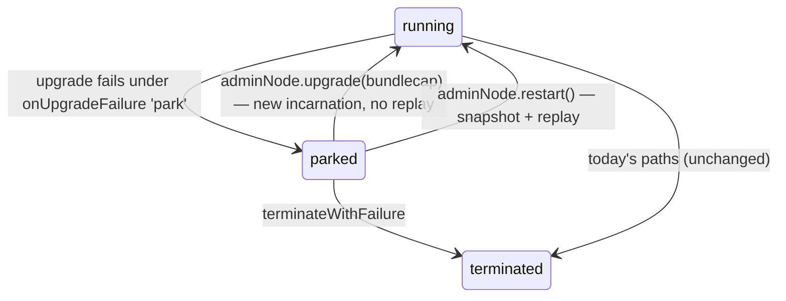

# Parked Vats

A **parked** vat is a live vat whose worker has been evicted but whose entire
durable state is retained, and whose incoming deliveries are deferred rather than
delivered or rejected. Parking is fully reversible: a parked vat can be resumed
with an explicit `upgrade` or `restart` on its admin facet.

Parking exists so that a vat which **fails to upgrade** — or, in a future phase,
one whose worker cannot be re-created because a transcript replay diverges — can
degrade gracefully into a quiescent-but-recoverable state instead of either
taking the whole kernel down (a panic) or silently thrashing back to its old
incarnation. It is the failure half of the legacy→latest engine-promotion story:
when promoting a vat to a new xsnap engine fails, that one vat parks instead of
halting the chain, and is fixed at leisure.

This document describes the operator- and developer-visible behavior. For the
full design rationale see the garden design note `xst-park-on-fail.md`.

## What "parked" means

When a vat parks:

* Its **worker is evicted** (`stopWorker`). No new worker is brought online for
  it — `ensureVatOnline` refuses a parked vat, and warehouse preload
  (`start()`), reap scheduling, and snapshot scheduling all skip it.
* **All durable state is retained**: the vatstore, c-lists, transcript spans, the
  last heap snapshot, meter, options, and incarnation number. Nothing is deleted.
* `vatIsAlive(vatID)` stays **true** — a parked vat is not dead. A new predicate,
  `vatIsParked(vatID)`, distinguishes it. Its exports are **not** orphaned, and
  promises it was deciding remain unresolved.
* **Deliveries are deferred, not refused.** Any run-queue event routed to a parked
  vat — a `send` whose target object it owns, a `notify` it subscribes to, or a GC
  delivery — is moved into a per-vat **park queue** (`${vatID}.parkQueue`) instead
  of being delivered. This is refcount-neutral: a queued message continues to hold
  refcounts on the krefs it references, exactly like a message moving between the
  acceptance and run queues. On resume the park queue drains FIFO onto the
  acceptance queue, ahead of new traffic.

The key consequence: **a parked vat is caller-observably indistinguishable from a
very slow vat.** No new error contract leaks to senders. A message sent to a
parked vat simply does not get a reply until the vat is resumed — the result
promise stays unsettled rather than rejecting. Clients need no new retry logic.

A parked vat can still be **terminated** with `terminateWithFailure` if nobody
will ever fix it (its park queue is then drained by splatting, and termination
proceeds as usual).



## Parking on a failed upgrade

`adminNode.upgrade(bundlecap, options)` gains an `onUpgradeFailure` option:

```js
await E(adminNode).upgrade(bundlecap, {
  vatParameters,
  onUpgradeFailure: 'park', // default: 'rollback'
});
```

* `'rollback'` (the default) preserves today's behavior: if the upgrade fails, the
  crank is unwound and the **old incarnation** is silently re-created from its
  snapshot and transcript on the next delivery.
* `'park'` instead degrades the vat into the parked state described above. The
  crank still unwinds, and the `upgrade()` promise still **rejects** with a
  `vat-upgrade failure` error — but the vat is now parked rather than rolled back,
  and its `${vatID}.parked` record notes the failure.

Rollback is only safe while an engine that can faithfully resume the old
snapshot/transcript still exists. When promoting a vat to a new engine — where a
rollback would land right back on the divergence — `'park'` is the correct policy.

Critical vats keep panic semantics in v1: a chain missing a critical vat is
presumed nonfunctional, so silently parking one would be worse than halting.

## Resuming a parked vat

Both resume verbs live on the vat's existing `adminNode` (the facet returned by
`E(vatAdminService).createVat`). No new authority is minted — whoever already
holds the `adminNode` holds resume authority.

### `upgrade(bundlecap, options)` — resume onto new code

Calling `upgrade()` on a parked vat resumes it by **upgrade**: the new incarnation
boots from durable state (baggage) with **no replay of the old-engine
transcript**, so this is the intended recovery once a fixed bundle or a fixed
engine ships. The pre-upgrade `bringOutYourDead` to the old incarnation is skipped
(a parked vat has no worker to run it). On success the park queue drains into the
new incarnation. If this resume-upgrade fails again, the vat **re-parks** rather
than terminating (there is no safe old incarnation to roll back to).

### `restart()` — resume by replay

`restart()` clears the parked flag and lets the normal delivery path re-create the
worker from the retained **snapshot + transcript**, then drains the park queue.
This is right when the cause was engine-environmental and has been fixed
engine-side (for example, a patched legacy binary restoring compatibility). If the
replay diverges again the vat re-parks; each retry costs one failed replay, never
a panic.

### `parkStatus()` — query

`parkStatus()` returns `{ parked, reason, phase, incarnation }`. Parking does not
settle `done()` — the vat is not dead.

## Static vats and the controller

Static vats have no `adminNode`; their resume path is the host/controller surface.
`controller.upgradeStaticVat(vatName, shouldPauseFirst, bundleID, options)` accepts
the same `onUpgradeFailure` option and routes through the vatAdmin vat's upgrade
path. On chain, these are reachable through core-eval governance.

The **bootstrap vat** remains non-upgradable: for it, parking converts a fatal
engine divergence into a degraded-but-alive chain, and `restart()` after an
engine-side fix is its only resume path.

## Kernel state

A schema bump (v4) seeds an empty `vats.parked` array, sibling to
`vats.terminated`. Per-vat park state is created lazily:

* `vats.parked` — JSON array of parked vatIDs.
* `${vatID}.parked` — JSON `{ reason, phase, incarnation, crankNum }`, present iff
  the vat is parked.
* `${vatID}.parkQueue` — the per-vat deferred-delivery queue (a `[head, tail]`
  marker plus `${vatID}.parkQueue.$NN` items), absent when empty.

None of this records wall-clock time, so parking is consensus-deterministic.
